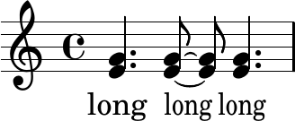

This is a sample snippet markdown.

Snippet image:

Snippet code, highlighted by Frescobaldi's exporter written by Urs:

<html>
<pre>
{
  &lt;e' g'&gt;4.
  \once \override Flag #'stencil =
  #(lambda (grob)
     (ly:stencil-scale (ly:flag::print grob) 1 0.8))
  q8~q8 q4.
}
\addlyrics {
  long
  \override LyricText #'stencil =
  #(lambda (grob)
     (ly:stencil-scale (lyric-text::print grob) 0.8 1))
  long
  long
}

</pre>
</html>
